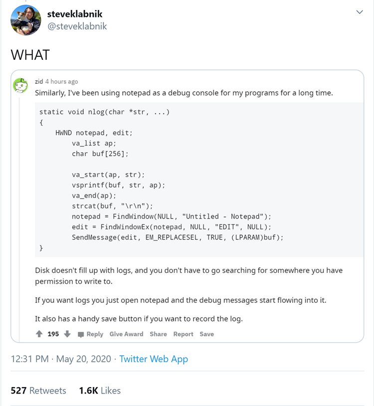

# Log to Notepad with Go
This is based on some things I saw floating around on Twitter and Hacker News, which ultimately were inspired by the post, [Ray Tracing In Notepad.exe At 30 FPS](http://kylehalladay.com/blog/2020/05/20/Rendering-With-Notepad.html) by Kyle Halladay.

[](https://twitter.com/steveklabnik/status/1263190719721766918)

I would be remiss if Go programs couldn't join in on the fun.

## Why?
¯\_(ツ)_/¯

## How?

Just use the provided io.Writer to do whatever you want. A demo of using it with Apex log is provided in [cmd/demo/main.go](./cmd/demo/main.go).

```go
    writer, _ := notepad.NewWriter()
    writer.Write([]byte("Hello, World!"))
```

Please don't use this for anything important.
